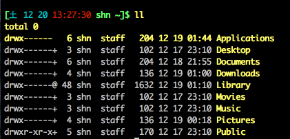

# bash color

```.sh
PS1='\[\e[1;32m\][\[\e[0;36m\]\[\d \[\e[0;31m\]\t \[\e[1;32m\]\u \w]\$\[\e[1;33m\] '
```


個人的には、色合いをどうするかって話で、カラフルが好きなのでこんな感じにしておく

# bash setting

```
export LANG=ja_JP.UTF-8
export LC_ALL='ja_JP.UTF-8'
export LC_MESSAGES='ja_JP.UTF-8'
export HISTCONTROL=ignoreboth
export HISTIGNORE="fg*:bg*:history*:cd*:ls*"
export HOMEBREW_GITHUB_API_TOKEN=@@@@@@@@@@@@@@@@@@@
```

HOMEBREW_GITHUB_API_TOKENは、GitHubのApplicationsでAccessTokenを生成してそれを突っ込む

→X-RateLimit-Limitを5000に増加させることが可能

# alias

```.sh
alias ls='ls -G'
alias ll='ls -l'
alias la='ls -a'
alias rm='rm -i'
alias df='df -h'
alias e='env'
alias grep='grep --color'
```
